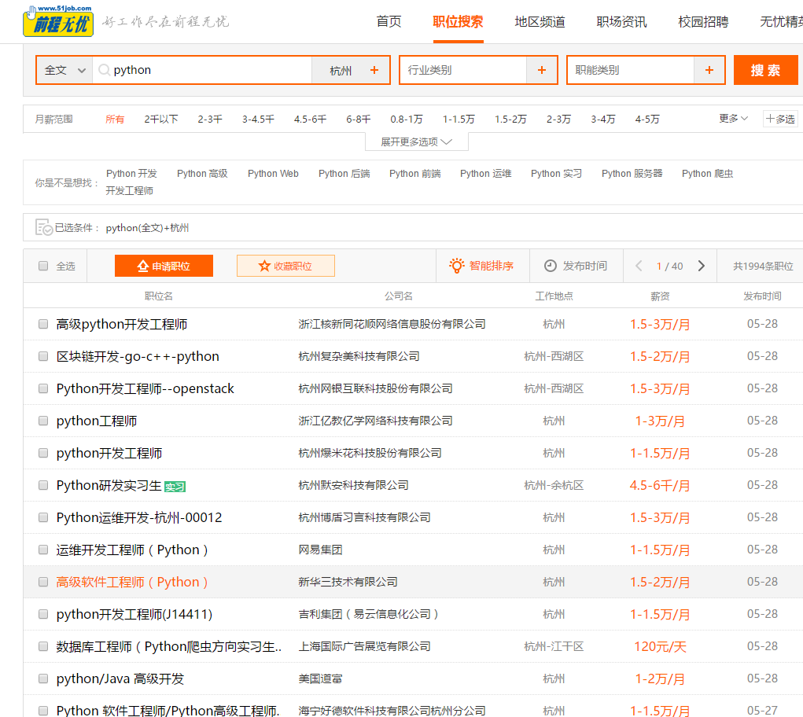
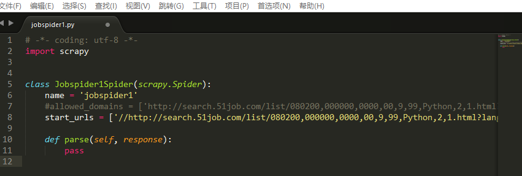
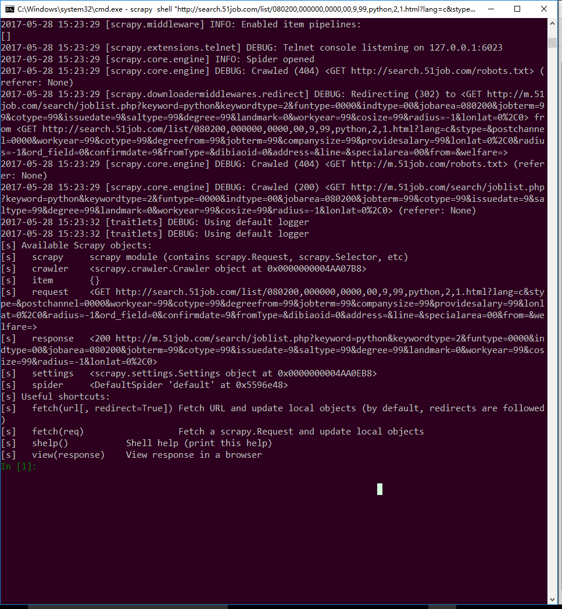

## 安装scrapy
scrapy的安装方法网上教程很多，这里不再赘述。仅简述一个Windows下较为简单的办法。首先安装[anaconda](https://www.continuum.io/downloads/),安装完成后打开cmd控制台输入
```
> conda install scrapy
```
conda会自动安装scrapy所需要的一些依赖，耐心等待安装结束后，在控制台输入，
```
> python
```
然后进入`python`控制台中，输入
```
> import scrapy
```
如果没有报错说明scrapy已经正常安装。

## scrapy常用命令

windows下使用`win`+`R`呼出CMD控制台，使用`cd`命令和`dir`命令进入想要保存项目的目录。
然后输入
```
scrapy startproject <工程名>
```

## 首先确定url：

这里我使用scrapy爬取51job上以Python为关键词搜索出的所有结果。
步骤：

打开[51job](http://www.51job.com/)，输入搜索词Python，复制得到的新网页的链接：http://search.51job.com/list/080200,000000,0000,00,9,99,Python,2,1.html?lang=c&stype=&postchannel=0000&workyear=99&cotype=99&degreefrom=99&jobterm=99&companysize=99&providesalary=99&lonlat=0%2C0&radius=-1&ord_field=0&confirmdate=9&fromType=&dibiaoid=0&address=&line=&specialarea=00&from=&welfare=。

+ 到指定目录下打开命令行输入：
```
scrapy startproject jobspider 
```
## 创建工程
 进入jobspider工程目录下创建spider:
```
cd jobspider
scrapy genspider jobspider1 "http://search.51job.com/list/080200,000000,0000,00,9,99,Python,2,1.html?lang=c&stype=&postchannel=0000&workyear=99&cotype=99&degreefrom=99&jobterm=99&companysize=99&providesalary=99&lonlat=0%2C0&radius=-1&ord_field=0&confirmdate=9&fromType=&dibiaoid=0&address=&line=&specialarea=00&from=&welfare="
```
运行完得到如下结果：
```
Created spider 'jobspider1' using template 'basic' in module:
  jobspider.spiders.jobspider1
```
然后打开：工程目录\spiders\下的jobspider1.py，使用任意文本编辑器即可，推荐sublime。


## 编写爬虫
接下来处理`jobspider1.py`文件：
首先可以注释掉allowed_domains这一行，然后将start_urls中的http去重。

重头戏来了，开始编写parse函数，可以使用`scrapy shell`帮助我们：
首先打开cmd命令行,输入：
```
> scrapy shell "http://search.51job.com/list/080200,000000,0000,00,9,99,python,2,1.html?lang=c&stype=&postchannel=0000&workyear=99&cotype=99&degreefrom=99&jobterm=99&companysize=99&providesalary=99&lonlat=0%2C0&radius=-1&ord_field=0&confirmdate=9&fromType=&dibiaoid=0&address=&line=&specialarea=00&from=&welfare="
```
看到一长串命令不知道是什么的东东后得到如下结果（以后会知道这些是爬虫的日志文件）：

然后可以看到Available scrapy objects有很多，我们先使用
``

## 总结
爬取静态页面很简单，下次讲爬取动态页面（其实也很简单）。
过程总结如下：
1. 创建项目以及spider；
2. 定义item；
3. 解析网页内容；
4. 编程以及调试debug；
5. 完成。
json输出可能有编码问题，解决办法：在settings.py文件中加入一行:
`FEED_EXPORT_ENCONDING = 'utf-8'`
